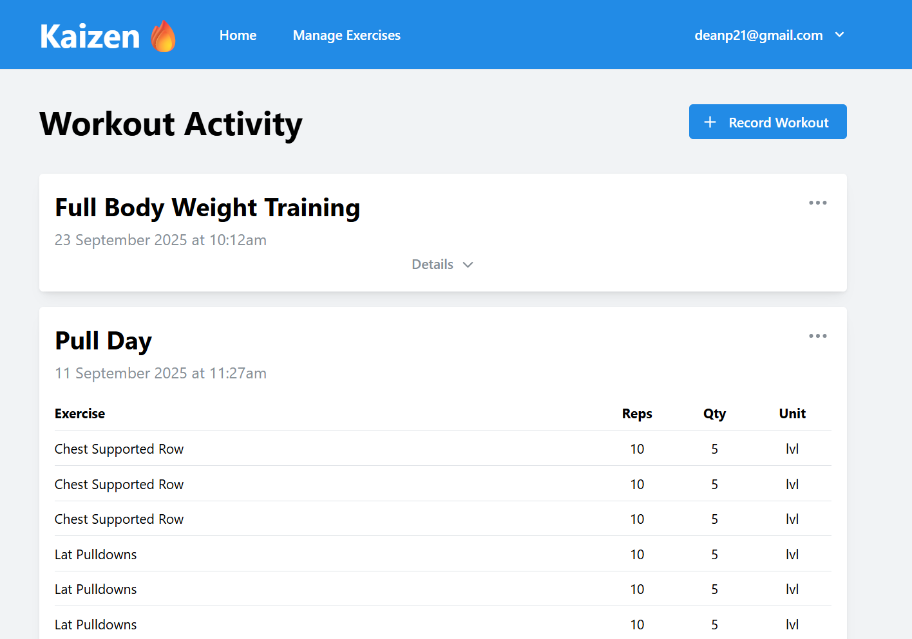
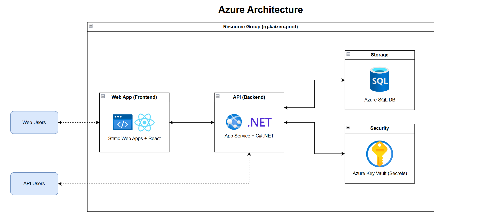

# 🔥 [Kaizen - Simple Workout Tracking](https://nice-ground-0389fcc1e.1.azurestaticapps.net/)

[Kaizen](https://en.wikipedia.org/wiki/Kaizen) comes from the Japanese philosophy of "Continuous Improvement." It's the
belief that small, consistent changes lead to meaningful long-term growth. This applies to your health, where steady
improvement and good habits can lead to a healthier life. 

Kaizen was born from a personal need to make workout tracking simple and efficient. Instead of logging workouts in
spreadsheets, Kaizen provides a way to plan and track workouts, helping you in your journey of a healthier body.

## ⭐ Features

> [!NOTE]
> It's still early days. There are lots of features planned, but perfection is the enemy of progress. It's better to get
> something deployed, rather than delaying from trying to cram features in one go. Incremental progress, living by Kaizen!

- **Workout Logging:** Record metrics such as sets, reps and weights quickly and consistently during or after your session.
- **Exercise Management:** Offload the administration of exercise data such as names and muscles used for a standardized experience. 

## 📝 License

This software is released under the Kaizen Source-Available License (Non-Commercial, No Redistribution).
You are free to explore the code, learn from it, and submit [feedback or feature requests](#-feedback--requests).

Commercial use, redistribution, or modification of this software is not permitted without explicit written permission
from the author.

The author(s) retains full rights to commercialize or relicense the software in the future. See [LICENSE](LICENSE.md)
for full details.

## 💬 Feedback & Requests

Kaizen is intended to be a source-available project created for learning, sharing, and continuous improvement.
Pull requests are not currently accepted, but feature suggestions, improvement ideas, and bug reports are welcome.

You can:
- Open a GitHub Issue for feature ideas or bugs
- Use Issues to discuss improvements or questions

All feedback helps guide the future direction of the project while keeping ownership and creative control centralized.

## 🚀 Production Architecture

A simple client-server architecture is used. Deployed on Azure, using their free tier offerings.

- **Frontend:** React + TypeScript Web App deployed with [Azure Static Web Apps](https://learn.microsoft.com/en-us/azure/static-web-apps/)
- **Backend:** ASP.NET REST API deployed with [Azure App Service](https://learn.microsoft.com/en-us/azure/app-service/)
- **Database:** [Azure SQL DB](https://learn.microsoft.com/en-us/azure/azure-sql/)
- **Secrets Management:** [Azure Key Vault](https://learn.microsoft.com/en-us/azure/key-vault/)

